# KoiDbg - Windows ARM64 Debugger for Reverse Engineering

A debugger for Windows ARM64 (AARCH64), user-friendly for reverse engineers, malware analysts, malware developers, game hacking, operating system studies, and more.

#### Demo Video

https://github.com/user-attachments/assets/ef55c64f-4ae1-463c-b356-1d4c7bf4c6d6

#### Papper and Research Information

To fully understand how KoiDbg works, read our published article. It is available in English and Portuguese:

- [Writing a Windows ARM64 Debugger for Reverse Engineering - KoiDbg](https://keowu.re/posts/Writing-a-Windows-ARM64-Debugger-for-Reverse-Engineering-KoiDbg/)
- [Escrevendo um Debugger para Windows ARM64 com foco em Engenharia Reversa - KoiDbg](https://keowu.re/posts/Escrevendo-um-Debugger-para-Windows-ARM64-com-foco-em-Engenharia-Reversa-KoiDbg/)

#### Screenshots

Disassembler View:

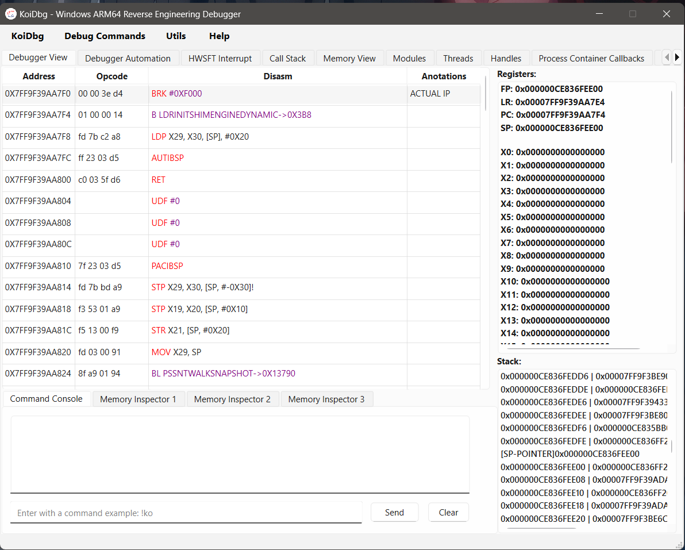

Hardware & Software Interrupt:

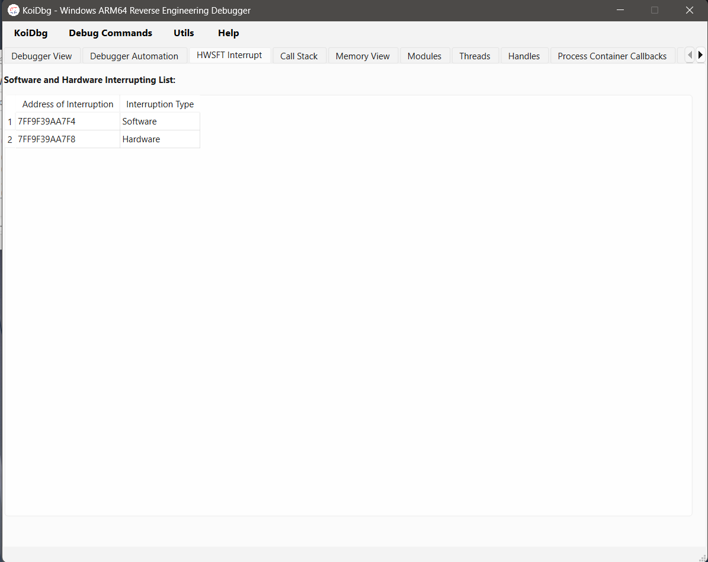

Call Stack:

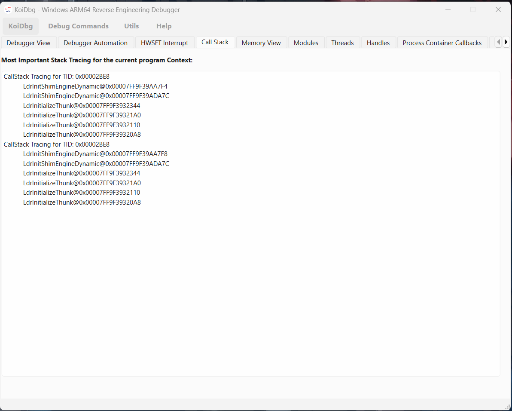

Memory View:

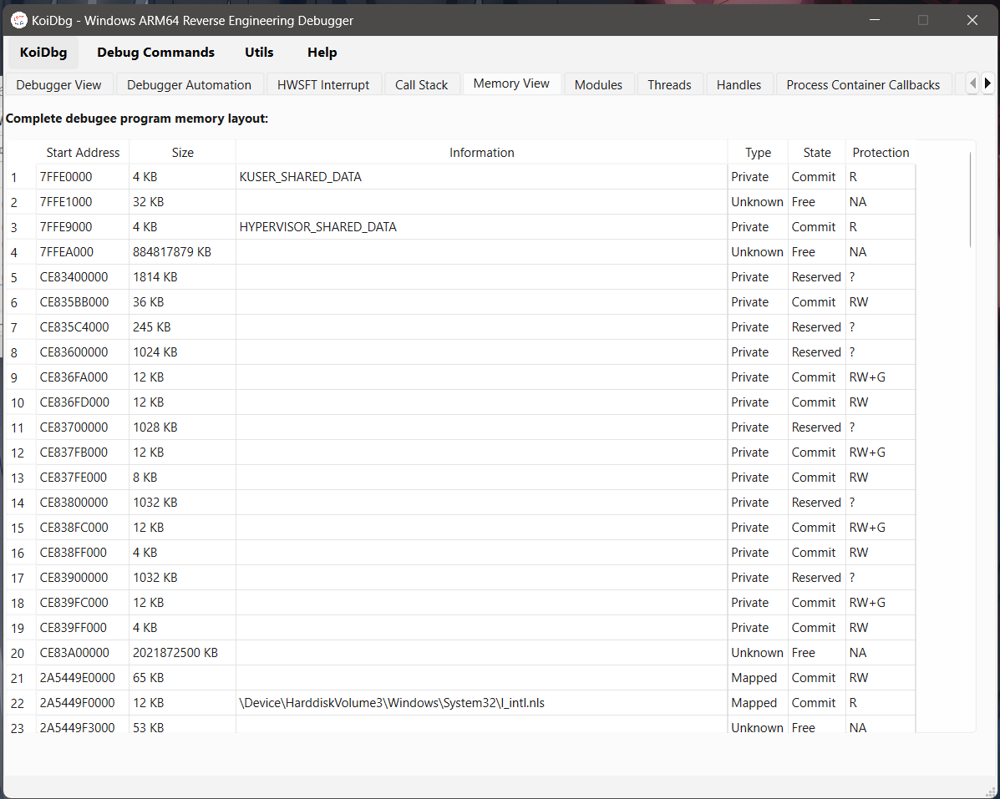

Modules View:

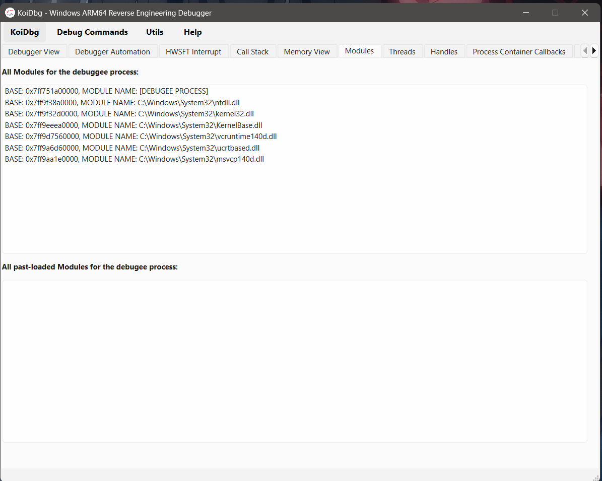

Threads View:

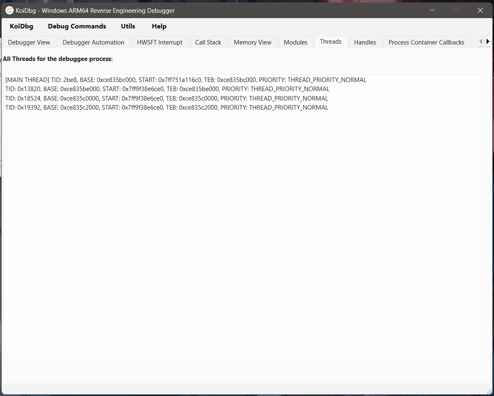

Handles View:

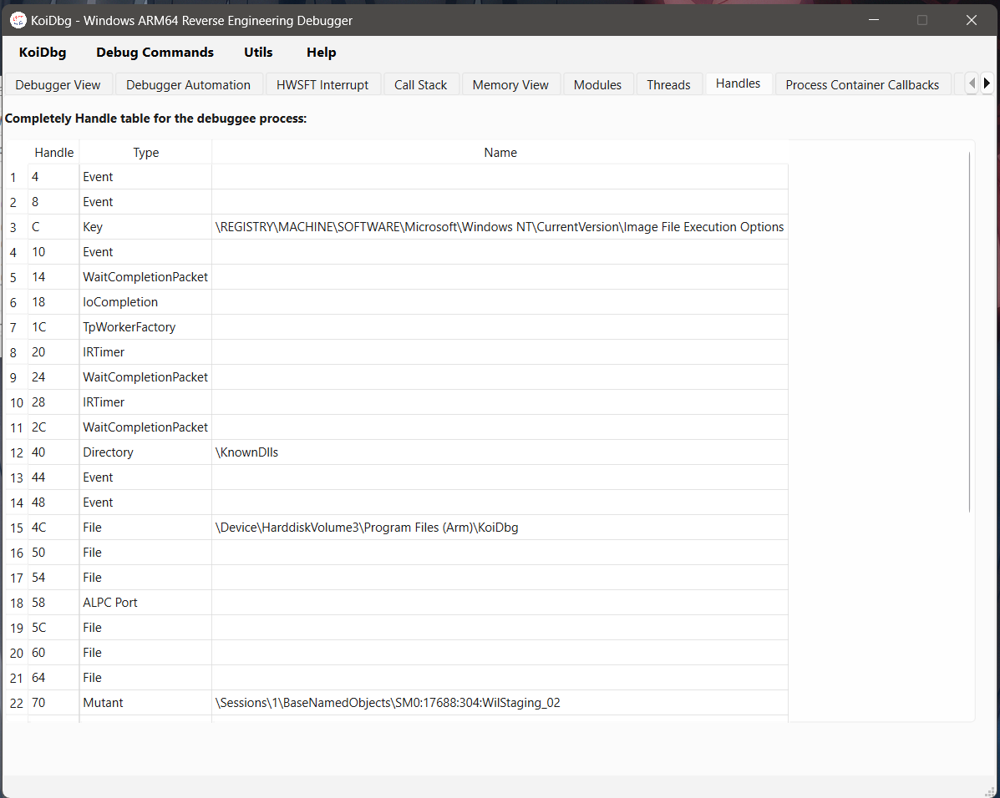

ProcessCallbacks View:

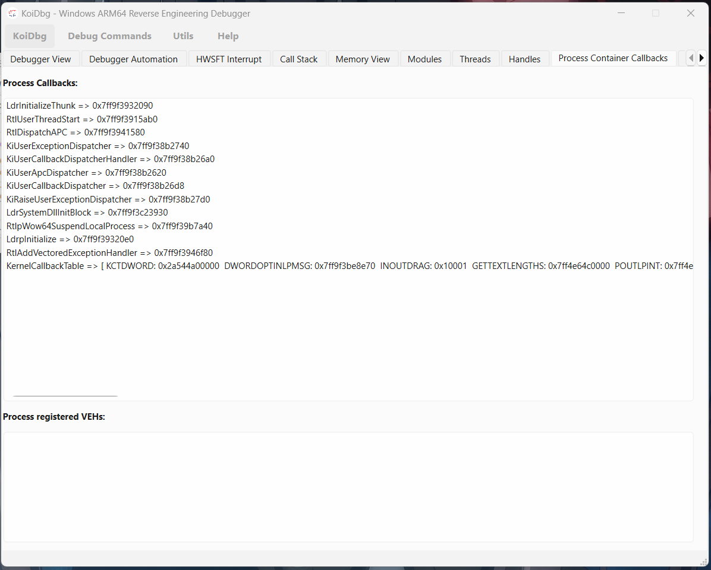

PDB Inspector:

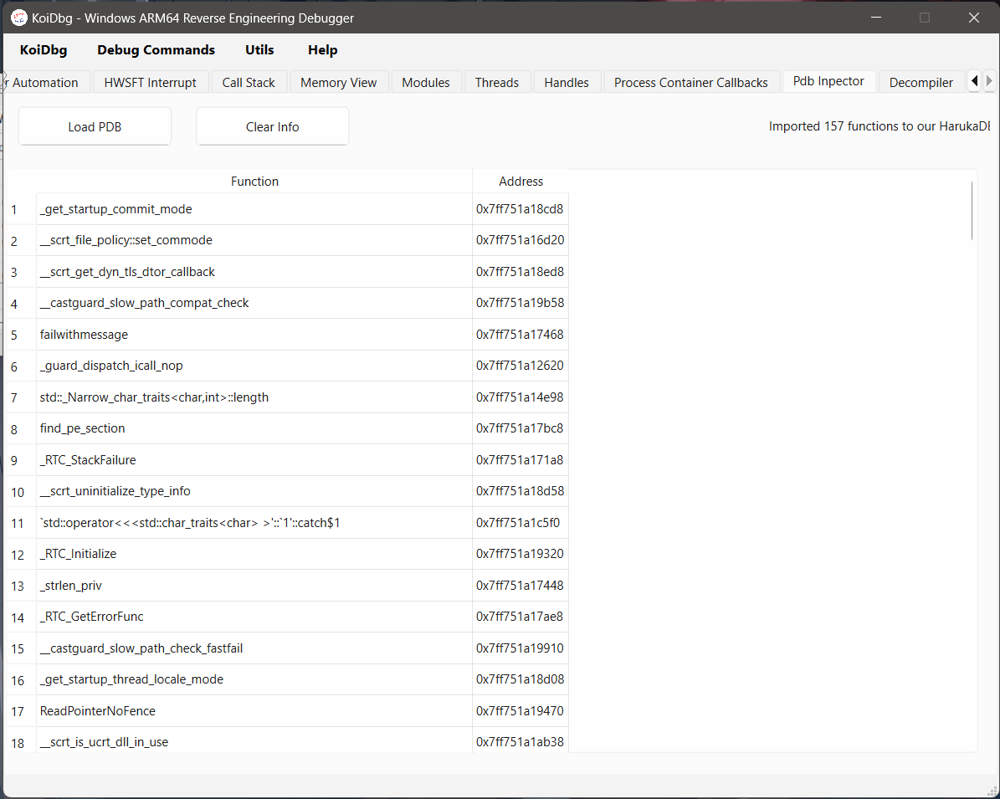

Hex View - Memory View:

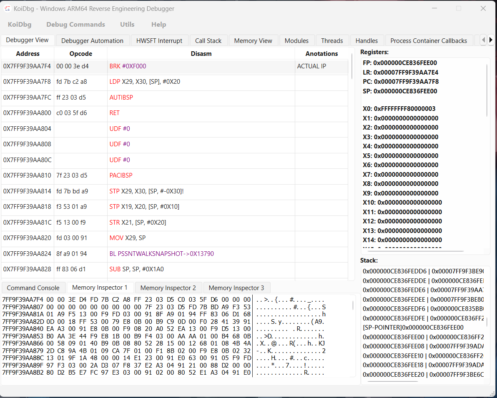

Console View:

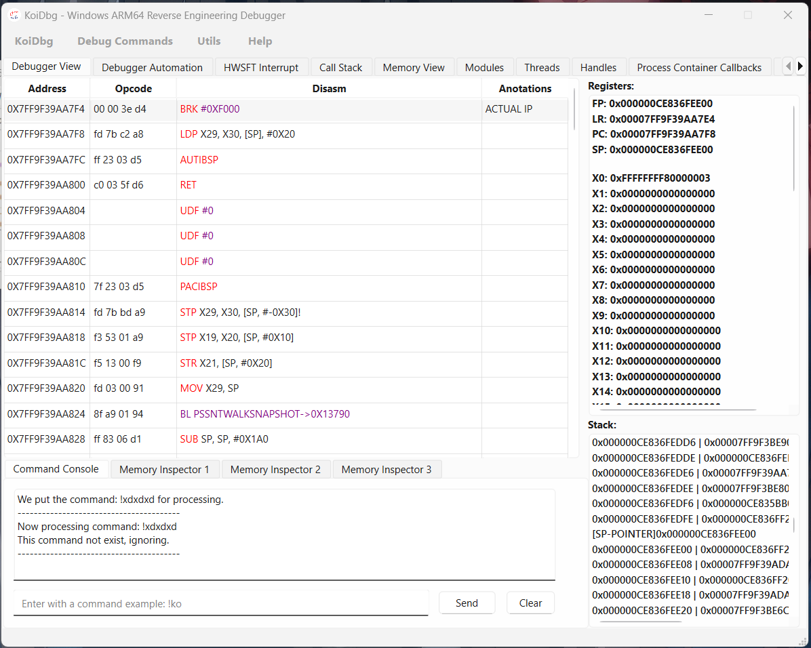

Local Stack Symbols:

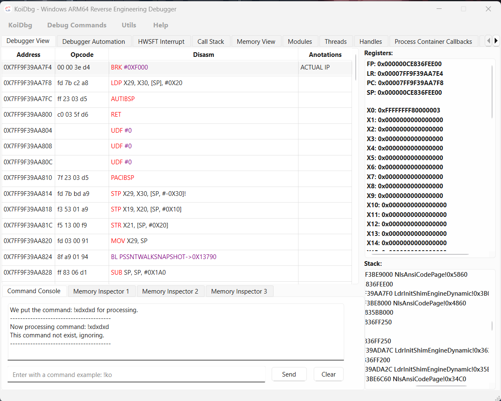

**And much more!**

#### License
This project/research is licensed under the GNU General Public License v3.0.
